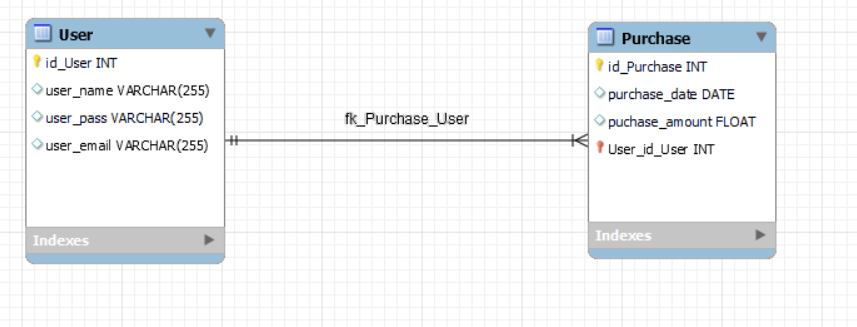
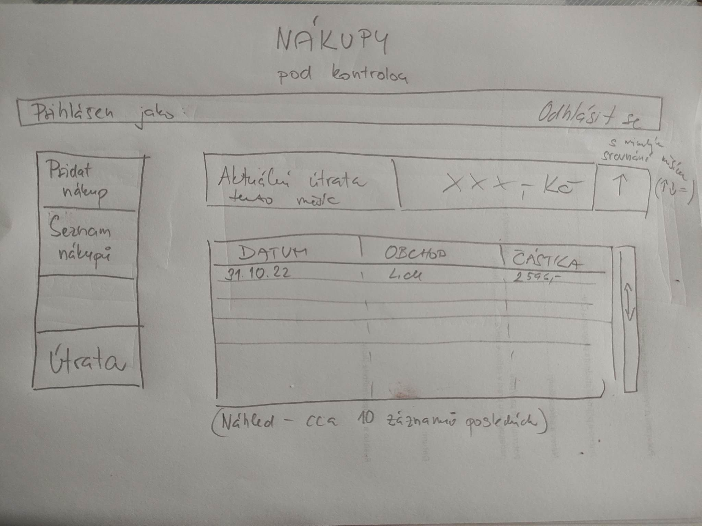

# Purchase

main soubory = indexy jednotlivych class
 - controllers/main.php -> obsahuje rozcestnik pro controllery
 - models/main.php -> obsahuje rozcestnik pro modely
 - views/main.php -> obsahuje rozcestnik pro views

API specifikace
 - GET  /           -- vytahne homepage
 - GET  /login      -- vytahne logovaci stranku
 - POST /login      -- zaloguje uzivatele
 - GET  /register   -- vytahne registracni stranku
 - POST /register   -- zaregistruje noveho uzivatele
 - GET  /spendings  -- stranka prehledu utraty
 - GET  /purchases  -- stranka na formular pridani purchase
 - POST /purchases  -- vytvori novou purchase
 - other            -- not found

## Uživatelská dokumentace

### Před spuštěním

1. Ujistěte se, že beží MySQL databáze na adrese `localhost:3306` s uživatelem `root`, bez hesla a s databází `purchases`.
2. Ujistěte se, že v databázi `purchases` jsou vytvořené tabulky dle technické dokumentace.

### Hlavní stránka

Umožňuje funkcionality:
- registrace
- login

### Spendings stránka

Umožňuje funkcionality:
- logout
- přidání nákupu
- zobrazení posledních nákupů v seřazeném stránkovatelném seznamu
- zobrazuje aktuální měsíční útratu
- zobrazuje trend mesíčních útrat oproti minulému měsíci

## Specifikace

### Aplikace Nákupy

Ráda bych vytvořila aplikaci na evidování nákupů. Přikládám specifikaci aplikace. Je velmi pravděpodobné, že až na ní budu pracovat, zjistím, že je potřeba něco udělat jinak, než zde popíšu. Základní myšlenka by však měla zůstat stejná.

#### Funkční specifikace:

##### Datový konceptuální model – EER Diagram



##### Funkčnost aplikace

Jde o aplikaci, která by umožnila uživatelům zadávat své nákupy, vést si tak jejich evidenci a sledovat výši své útraty.

##### Specifikace uživatelských rolí a oprávnění

Uživatel

* může se přihlásit
* může vkládat/mazat nákupy
* může si prohlížet seznam nákupů
* může sledovat svou útratu

 
##### Uživatelské grafické rozhraní 



#### Technické specifikace:

##### Popis architektury jednotlivých částí
* MVC pattern
* Laravel jako hlavní MVC framework
* Vue.js jako view framework pro reaktivní client-based frontend

##### Popis jednotlivých tříd
* User – vše kolem uživatele, přihlášení (register, login)
* Purchase – vše kolem nákupů (add purchase, remove purchase, list purchases, compute spendings, get spendings trend)


## Technická dokumentace

### Databáze

```sql
CREATE TABLE IF NOT EXISTS `purchases_user` (
  `id` INT NOT NULL AUTO_INCREMENT,
  `user_name` VARCHAR(255) NULL,
  `user_password` VARCHAR(255) NULL,
  `user_email` VARCHAR(255) NULL,
  PRIMARY KEY (`id`))
ENGINE = InnoDB;


CREATE TABLE IF NOT EXISTS `purchases_purchase` (
  `id` INT NOT NULL AUTO_INCREMENT,
  `purchase_name` TEXT NOT NULL,
  `purchase_date` DATE NOT NULL,
  `puchase_amount` FLOAT NOT NULL,
  `user_id` INT NOT NULL,
  PRIMARY KEY (`id`),
  INDEX `fk_purchase_user_idx` (`user_id` ASC),
  CONSTRAINT `fk_purchase_user`
    FOREIGN KEY (`user_id`)
    REFERENCES `purchases_user` (`id`)
    ON DELETE CASCADE
    ON UPDATE NO ACTION)
ENGINE = InnoDB;
```

### Architektura

Aplikace dodržuje standardní MVC pattern. Je rozdělena do 3 částí - `controllers`, `models` a `views`. Každá z těchto částí obsahuje `main.php` soubor, který funguje jako rozcestník k jednotlivým podčástem a obsahuje společnou funkcionalitu.

#### Kontrolery

Kontrolery obsahují pouze jeden soubor - `main.php`. Tento soubor obstarává veškerý routing. Na základě cest a parametrů provolává příslušné funkce na modelech a vybírá view, které se má uživateli zobrazit.

#### Modely

Modely obsahují ucelené funkce pro práci s databází a zpracovávání uživatelských dat. Aplikace obsahuje dva modely:

- User (registrace a login uživatelů)
- Purchase (vytvoření nového nákupu, odstranení nákupu, listování přehledem nákupů)

#### Views

Views obsahují HTML s minimem php a javascriptu pro zobrazení relevantních informací uživateli.